# Orientation

## Core Vocab & Phrases（核心词汇与短语）

### Training(培训)

Orientation(入职培训), training(培训), learn(学习);替换词:Onboarding(入职指导), study(学习), practice(实操)

### Work Place(工作相关)

Company(公司), team(团队), rule(规则);替换词:Firm(公司), group(小组), regulation(制度)

### Action(动作)

Know(了解), follow(遵守), join(参加);替换词:Understand(明白), obey(遵守), take part in(参与)

### Expression Phrases(表达短语)

I join the orientation(我参加入职培训), learn company rules(学习公司规则);替换词:I take part in the onboarding process(我参加入职指导), know team work(了解团队工作)

## Practical Dialogues（实用对话）

Dialogue 1: Talking about Orientation with the HR（与人力资源部门讨论入职指导事宜）
A (HR): Hi, you will join the company orientation this morning.
B (You): OK, thank you. What will we learn in the orientation?
A: You will learn the company rules and meet your team members.
B: Great. I want to know more about the team work.

Dialogue 2: Talking about Orientation with a New Teammate（与新同事谈论入职培训事宜）
A (New Teammate): Hi, do you finish the orientation?
B (You): Yes, I just finish it. It’s very useful.
A: What do you learn from it?
B: I learn the company rules and how to work with the team.

## Key Sentence Patterns（重点句型）

I will join the company orientation.
（我将要参加公司的入职培训。）

We learn [Content] in the orientation.
（我们在入职培训中学习 [内容]。）

I know the company rules from the orientation.
（我从入职培训中了解了公司规则。）

The orientation helps me know the team.
（入职培训帮我了解了团队。）

I take part in the onboarding this morning.
（我今天上午参加了入职指导。）

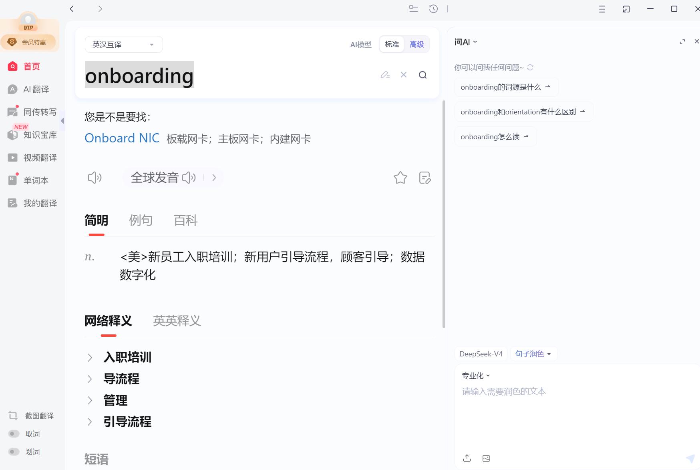
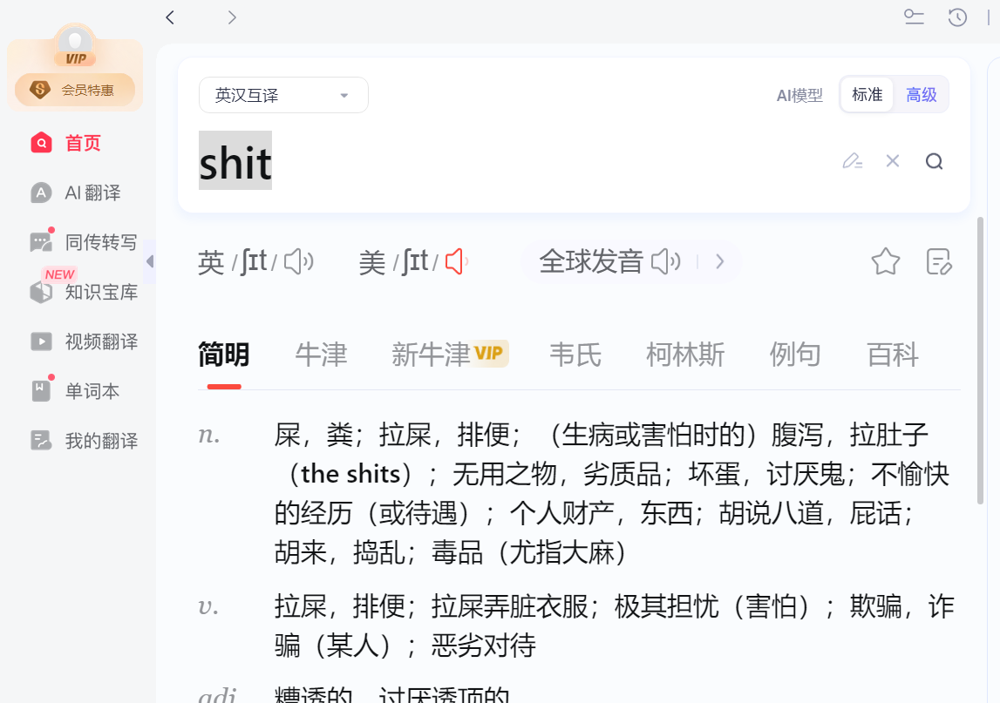
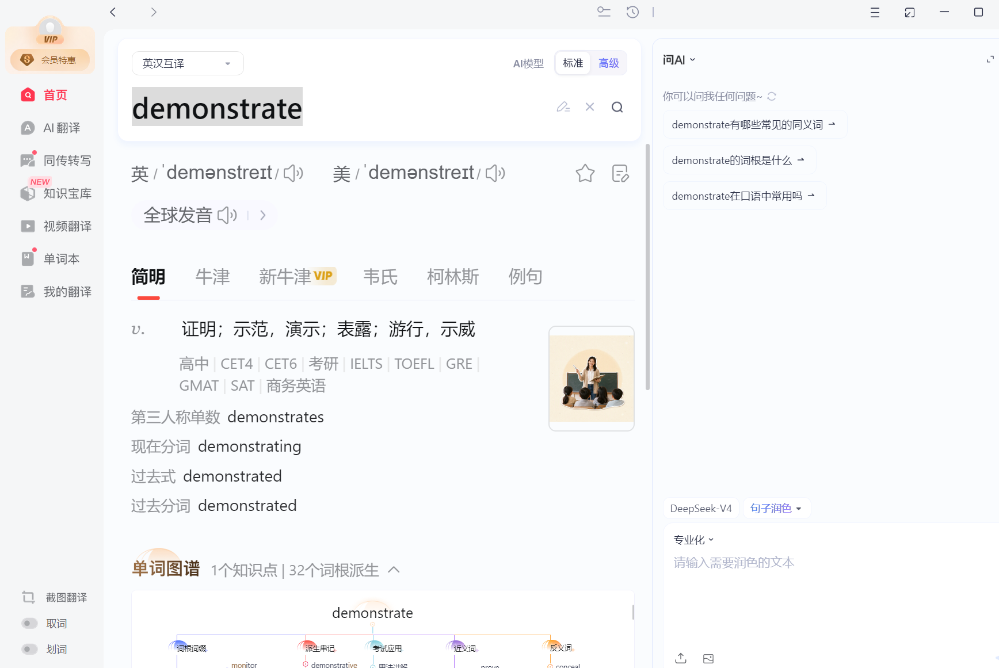
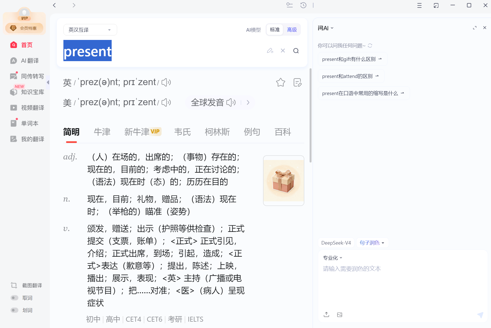
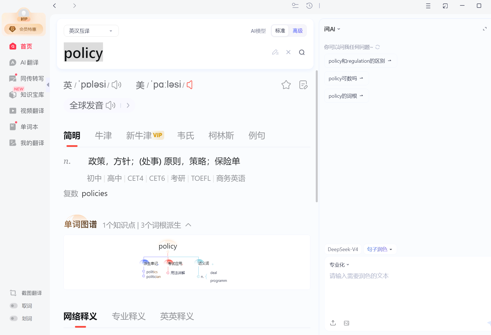
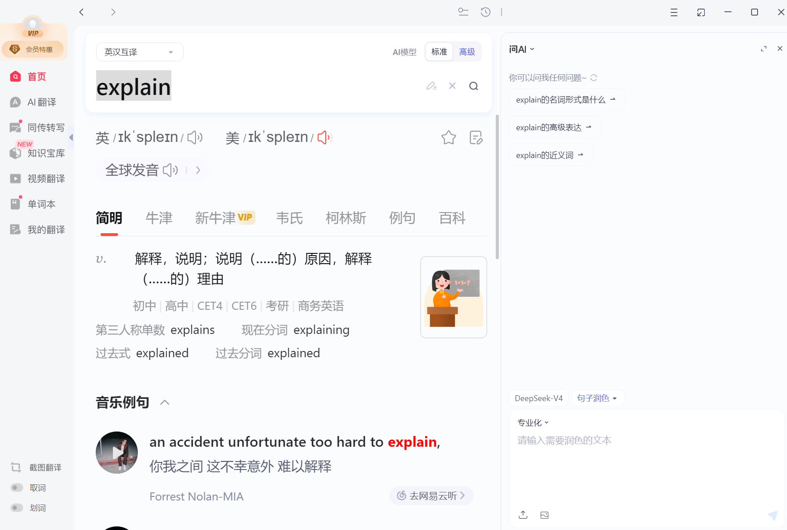
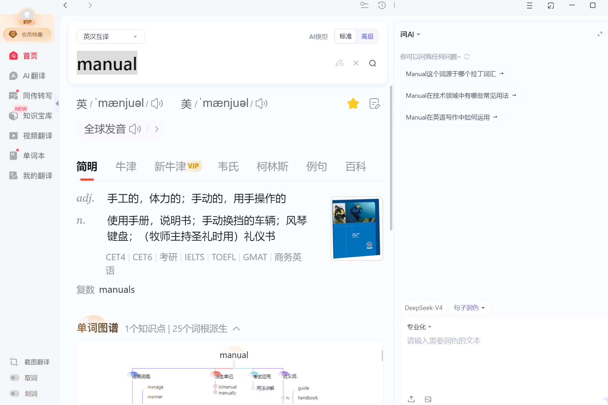
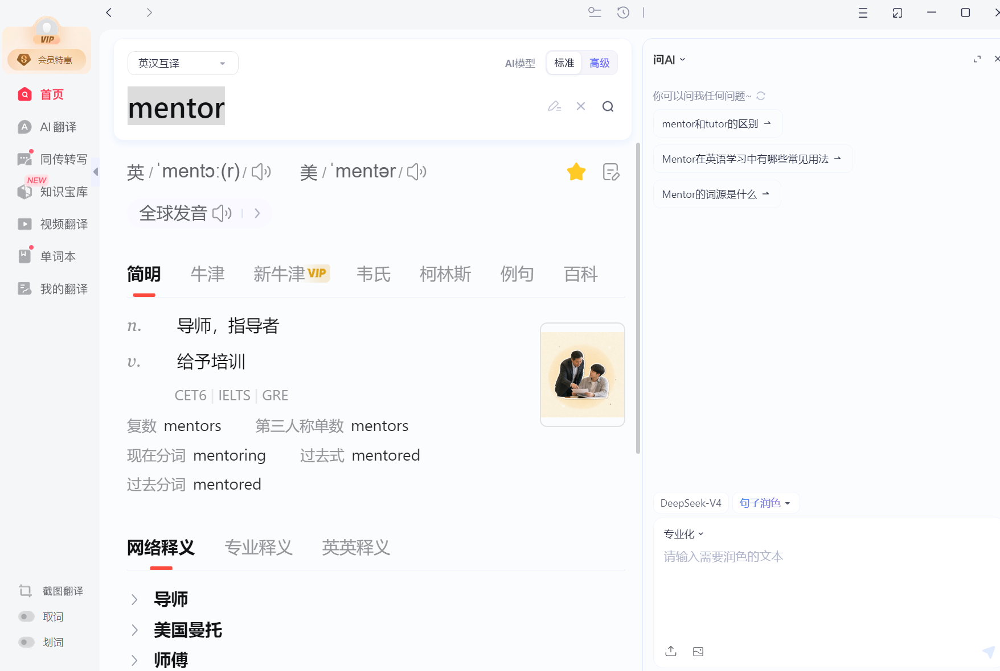
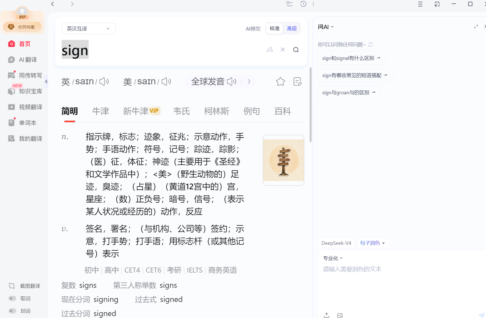
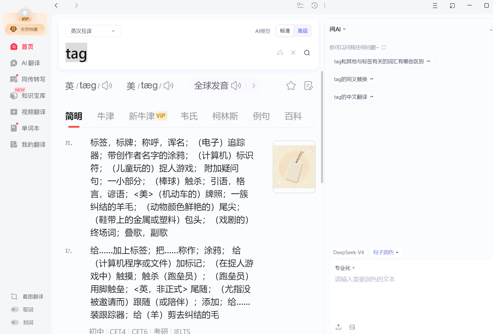
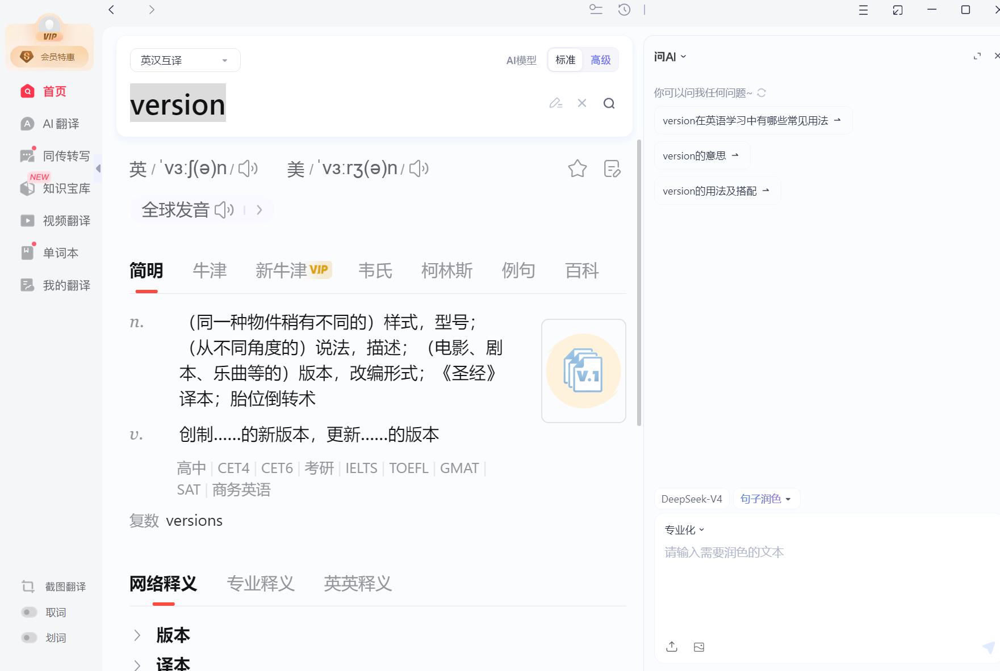

## Core Vocab & Phrases（核心词汇与短语）

### Orientation Basics（入职培训基础）

orientation（入职培训）, new employee（新员工）, orientation session（入职培训场次）；替换词： new hire（新员工）, onboarding session（入职引导会）

### Orientation Process（培训流程）

sign in（签到）, introduce（介绍）, explain（讲解）, demonstrate（演示）；替换词：present（介绍）, clarify（说明）, show（演示）

### Workplace Basics（职场基础）

company culture（企业文化）, rules and regulations（规章制度）, workflow（工作流程）；替换词：company policies（公司政策）, work process（工作流程）

### Common Expressions（职场常用表达）

Welcome to the orientation session.（欢迎参加入职培训。）; Could you explain the company’s rules?（您能讲解一下公司的规章制度吗？）; I need help with the internal system.（我需要内部系统的相关帮助。）

## Dialogue 1: Orientation Process for New Hires（新员工入职培训流程）

HR Coordinator (Lily): Good morning, everyone! Welcome to our company’s orientation. I’m Lily, your HR coordinator. Please sign in first, take a name tag and an orientation manual. We’ll start soon.

You (New Employee): Thank you, Lily. I’m [Your Name], a new backend developer. Could you confirm which orientation manual I should use? Do I need to submit any documents today?

Lily: Hi [Your Name], welcome! You can use either English or Chinese version. You don’t need to submit any documents today—we’ll give you a company ID card this afternoon.

You: Thank you. Will we visit the office later? I want to know where the IT support office is.

Lily: Yes! After the company introduction, we’ll take a short tour. Then our IT specialist will show you how to use the internal system.

You: Great. When will I meet my mentor and department leader?

Lily: After the orientation this morning, you’ll meet them at 2 PM. Now let’s start the training.

You: Sure, thank you, Lily!

### Dialogue 2: Post-Orientation Follow-Up（入职培训后跟进）

You: Good afternoon, Lily. I’m [Your Name]. I have a few questions after the training.

Lily: Hi [Your Name]! Feel free to ask—I’m here to help you.

You: Thank you. I didn’t catch how to apply for office supplies through the internal system. Could you help me?

Lily: Of course! Log in to the internal platform, click “Office Management”, select “Office Supplies Application”, choose the items you need and submit. I’ll send you a simple guide too.

You: That’s helpful. Also, could you confirm tomorrow’s training time and place?

Lily: It starts at 9 AM in Meeting Room 3. Arrive 10 minutes early, and you don’t need to prepare anything.

You: Perfect, that’s all. Thank you so much!

Lily: You’re welcome! Contact me anytime if you have other questions.
