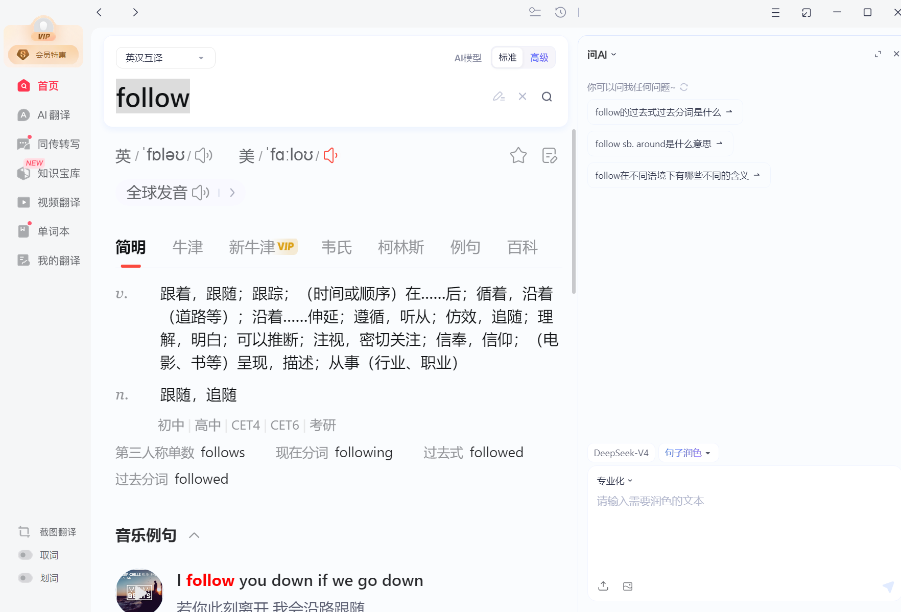
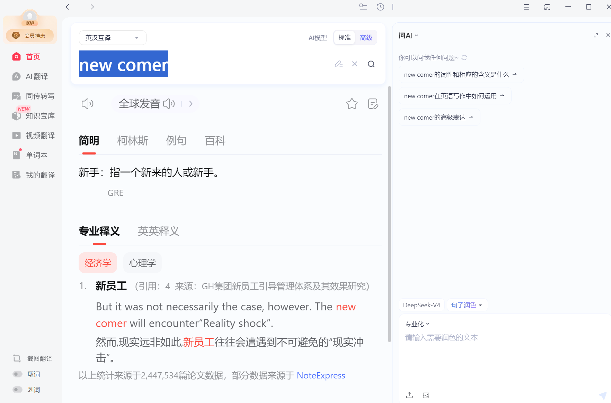
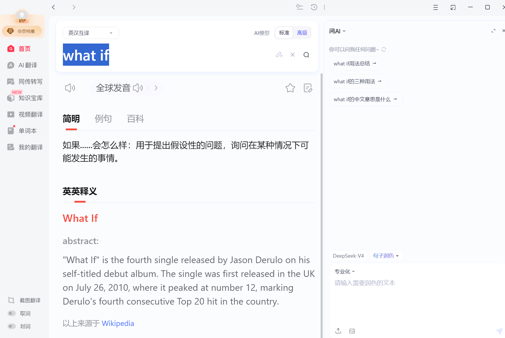
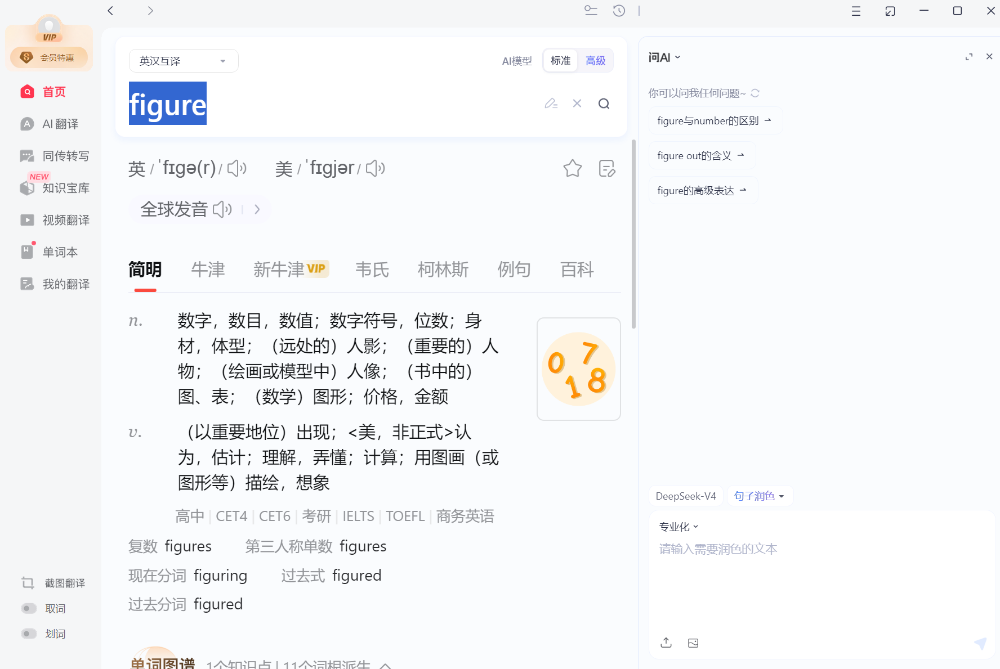
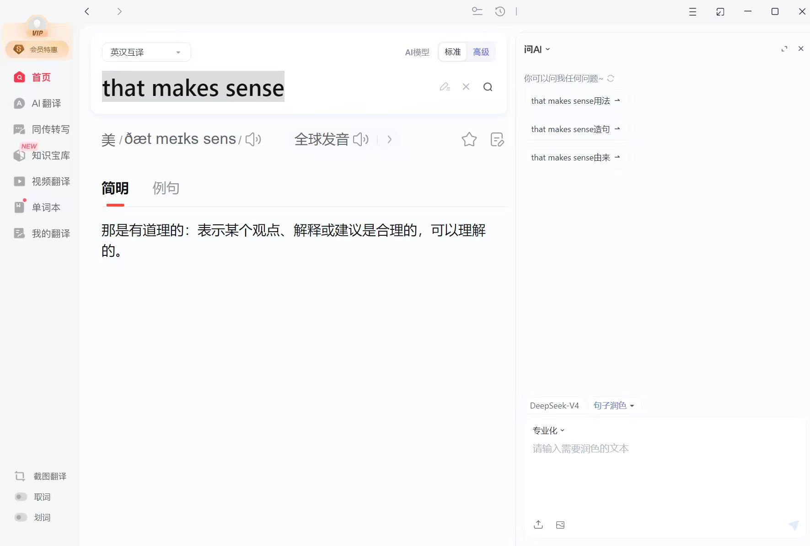
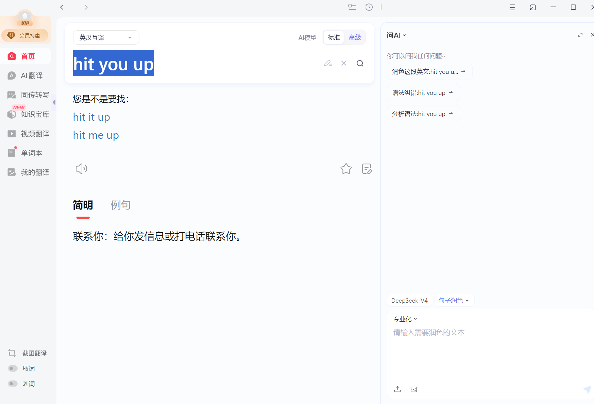
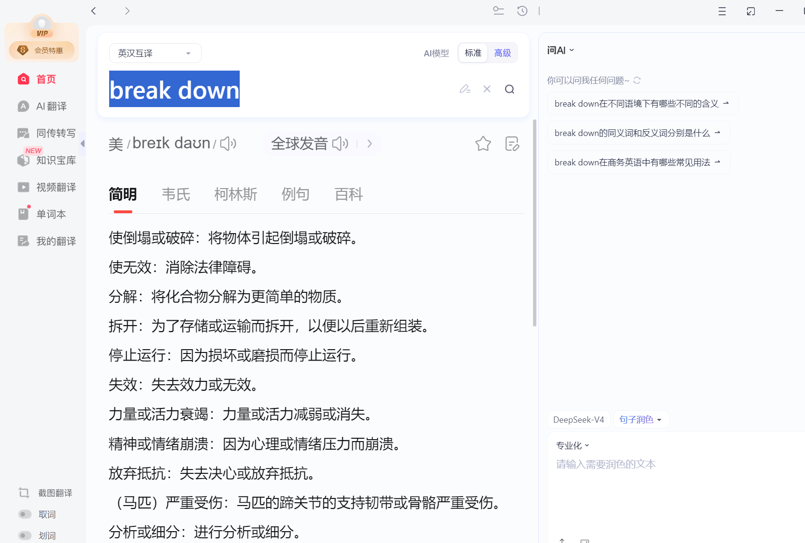
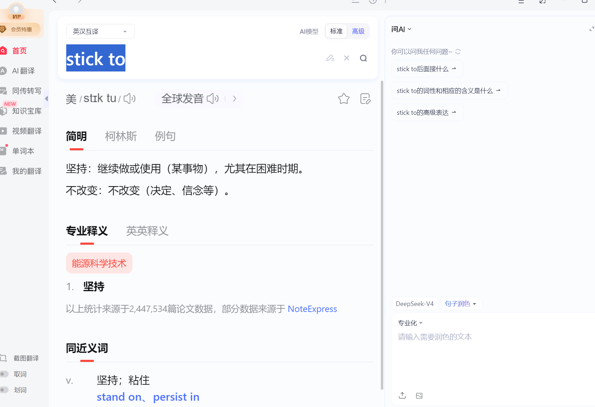
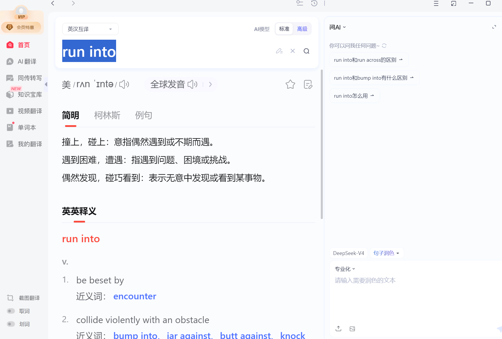

# Work Schedules

## Core Vocab & Phrases（核心词汇与短语）

### Work Schedule（工作安排）

Work schedule（工作安排）, daily work（日常工作）, plan（计划）；替换词：Work plan（工作计划）, daily task（日常任务）, arrangement（安排）

### Time & Action（时间与动作）

Start（开始）, finish（结束）, do（做）；替换词：Begin（开始）, end（结束）, complete（完成）, deal with（处理）

### Work Content（工作内容）

Task（任务）, work（工作）, project（项目）；替换词：Job（工作）, assignment（任务）, task（活儿）

### Expression Phrases（表达短语）

My work schedule is（我的工作安排是）, I start work at（我几点开始工作）, I need to finish（我需要完成）；替换词：I arrange my work（我安排我的工作）

## Practical Dialogues（实用对话）

Dialogue 1: Talking About Daily Work Schedule with a Colleague（与同事谈论日常工作安排）
A (Colleague): What’s your work schedule today?
B (You): I start work at 9 o’clock. I need to finish my task this morning.
A: Do you have other work this afternoon?
B: Yes. I will deal with a small project with our team.

Dialogue 2: Asking About Work Schedule（询问工作安排）
A (Team Lead): What’s your work schedule tomorrow?
B (You): I will finish the task first. Then I will test the program.
A: Good. Finish it on time.
B: OK, I will.

## Key Sentence Patterns（重点句型）

My work schedule is [Content].
（我的工作安排是[内容]。）

I start work at [Time].
（我在[时间]开始工作。）

I need to finish [Task] today.
（我今天需要完成[任务]。）

I will [Action] with my team this afternoon.
（我今天下午要和团队一起[动作]。）

My daily work is to [Work Content].
（我的日常工作是[工作内容]。）

My work schedule is to write code.
I will share my progress whith my team this afternoon
My daily work is to wirte code.

## Core Vocab & Phrases（核心词汇与短语）

### Work Schedule（工作安排）

Work schedule（工作安排）, daily work（日常工作）, plan（计划）；替换词：Work plan（工作计划）, daily task（日常任务）, arrangement（安排）

### Time & Action（时间与动作）

Start（开始）, finish（结束）, do（做）, finish（完成）；替换词：Begin（开始）, end（结束）, complete（完成）, deal with（处理）

### Work Content（工作内容）

Task（任务）, work（工作）, project（项目）；替换词：Job（工作）, assignment（任务）, task（活儿）

### Expression Phrases（表达短语）

My work schedule is（我的工作安排是）, I start work at（我几点开始工作）, I need to finish（我需要完成）；替换词：I arrange my work（我安排我的工作）

## Dialogue 1: Asking About Daily Work Schedule（询问日常工作安排）

You (New Employee): Good morning, Team Lead. I’m new here and still not familiar with the daily work schedule. Could you tell me our working hours and break time? I also want to know if there are any special rules about the schedule.

Team Lead: Hi! Welcome again. Our daily working hours are from 9 AM to 6 PM, and we have a one-hour lunch break from 12 PM to 1 PM. During the break, you can go to the pantry for meals or rest in the office.

You: Thank you so much. That’s clear. Do we have any fixed daily tasks to finish? And when do we usually have team meetings? I want to make sure I won’t miss anything important.

Team Lead: Don’t worry. We have a short team meeting every morning at 9:10 AM, right after we start working. At the meeting, we’ll go over the daily tasks and progress. Your main daily task is to finish the work assigned to you, and you need to report your progress to me before 5:30 PM every day.

You: Got it. What if I can’t finish the assigned work on time? Should I inform you in advance?

Team Lead: Yes, if you have any difficulty in finishing the work on time, please let me know as soon as possible. We can adjust the task arrangement together. Also, if there’s any change to the daily schedule, I’ll inform you in time.

You: Understood. Thank you for your detailed explanation (ai). I’ll follow the schedule and inform you if I have any problems.

Team Lead: You’re welcome. Let me know if you have other questions about the work schedule or anything else.

### Dialogue 2: Asking About Daily Work Schedule（询问日常工作安排）

You (New Employee): Morning, Team Lead! I’m new here, so I’m still figuring out the daily schedule. Can you tell me our work hours （a） and break time? Also, are there any special rules I should know about?

Team Lead: Hey! Welcome again. We work from 9 AM to 6 PM every day, and lunch break is from 12 to 1 PM—an hour total. You can grab food from the pantry or just chill in the office during that time, whatever’s easier.

You: Thanks so much, that makes sense! Do we have any daily tasks we have to get done? And when do we usually have team meetings? I don’t wanna miss anything important.

Team Lead: No worries! We have a quick team meeting every morning at 9:10, right after we start. We’ll go over what we need to do that day and how we’re progressing. Your main job each day is to finish the tasks I assign you, and just check in with me before 5:30 PM to let me know how you’re doing.

You: Got it. What if I can’t finish my tasks on time? Should I tell you ahead of time?

Team Lead: Yeah, if you’re having trouble finishing on time, just let me know as soon as you can. We can tweak the task list together. Also, if the schedule changes for any reason, I’ll hit you up right away.

You: Got it, thanks for breaking it down for me! I’ll stick to the schedule and let you know if I run into any issues.

understand, I see, Got it

quick call, quick meeting

We should break it down into smaller ones.

https://meeting.tencent.com/cw/Ngb4mVGd3c

## Key Sentence Patterns（重点句型）

Could you tell me our working hours and break time?
（您能告诉我我们的工作时间和休息时间吗？）

Are there any special rules about the schedule?
（关于工作安排有什么特殊规定吗？）

Do we have any fixed daily tasks to finish?
（我们有需要完成的固定日常任务吗？）

When do we usually have team meetings?
（我们通常什么时候开团队会议？）

What if I can’t finish the assigned work on time?
（如果我不能按时完成分配的工作怎么办？）
Should I inform you in advance?
（我需要提前通知您吗？）

Please let me know as soon as possible.
（请尽快告诉我。）

I’ll follow the schedule and inform you if I have any problems.
（我会遵守安排，有问题会通知您。）

Can you tell me our work hours and break time?
（能告诉我我们的工作时间和休息时间吗？）

I’ll stick to the schedule and let you know if I run into any issues.
（我会遵守安排，遇到问题会告诉你。）
