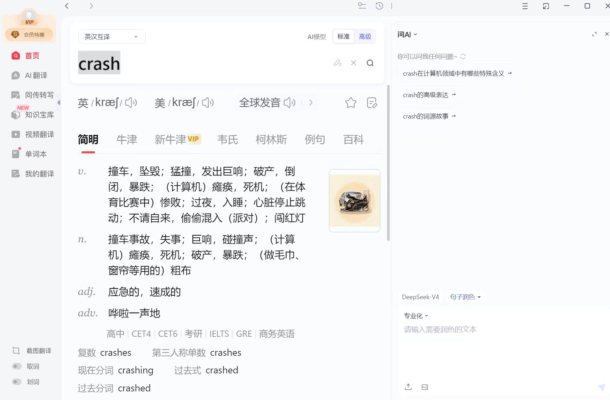
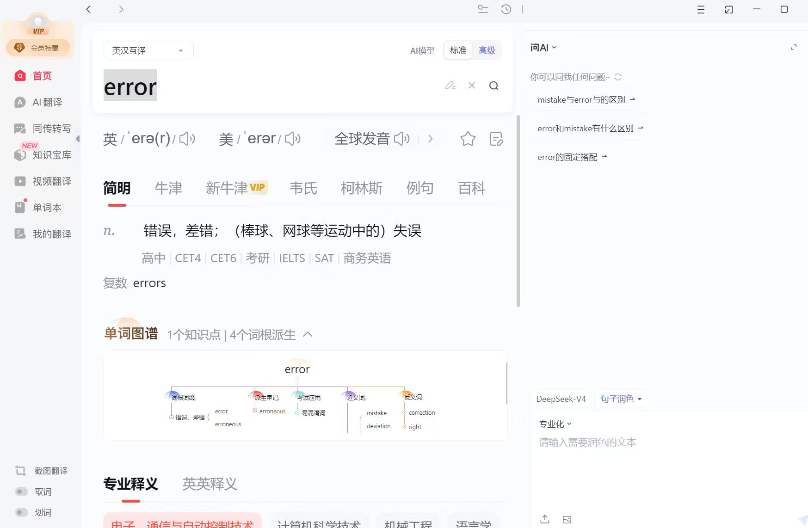
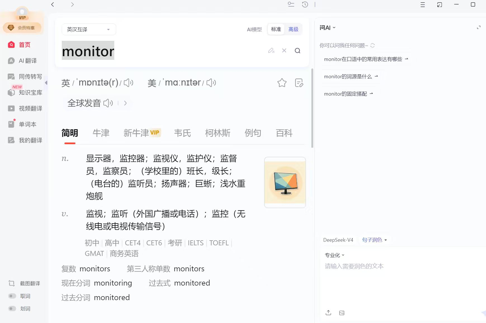
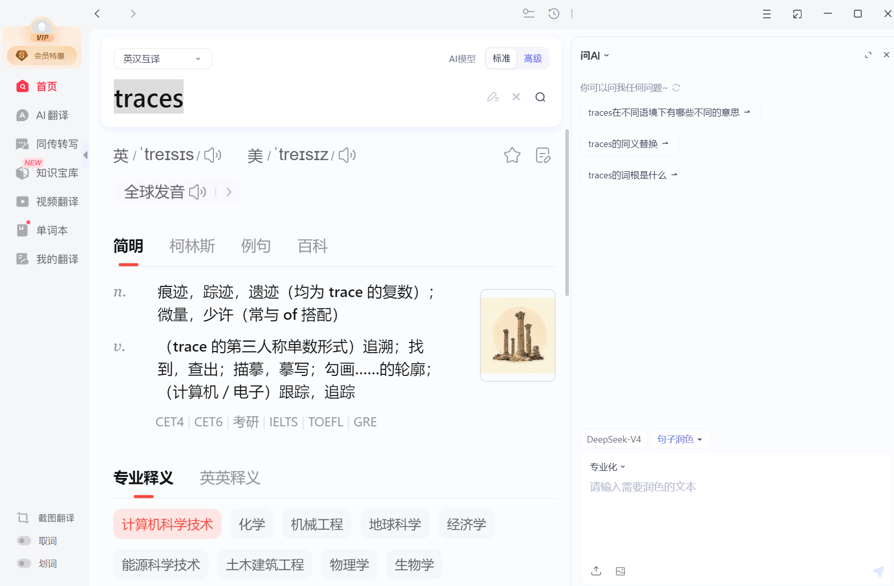
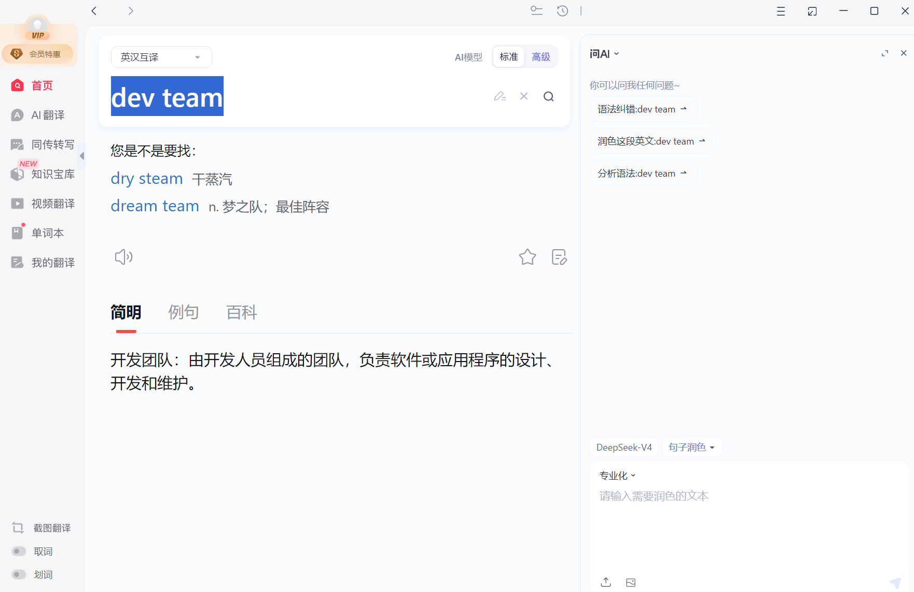
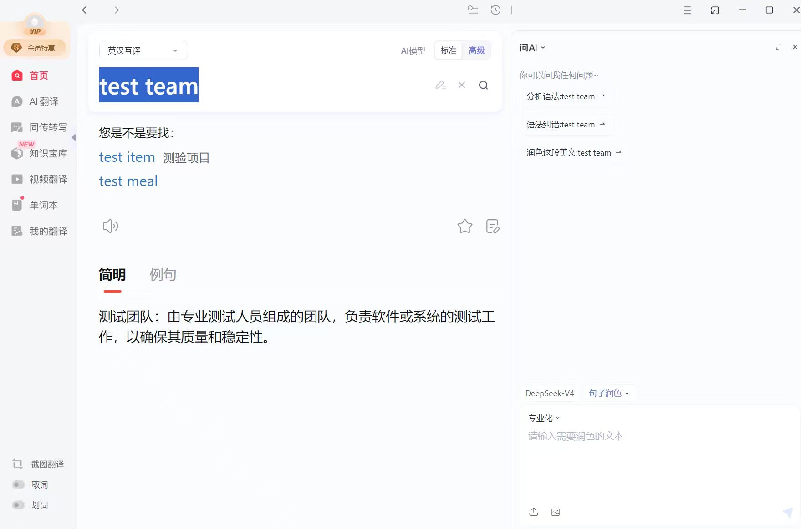
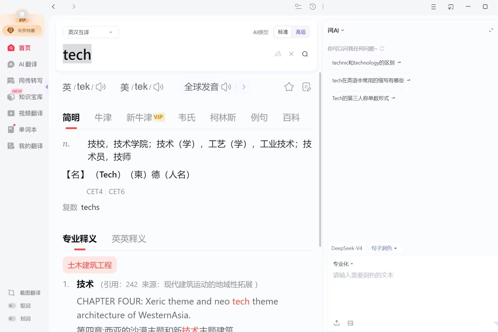

# Arranging a Meeting

## Core Vocab & Phrases（核心词汇与短语）

### Arrange a Meeting（安排会议）

Arrange a meeting（安排会议）, organize a meeting（组织会议）, set a meeting（定会议）；替换词：Plan a meeting（计划会议）

### Meeting-related（会议相关）

Meeting（会议）, time（时间）, place（地点）, topic（主题）, room（房间）, subject（主题）

### Action（动作）

Ask（询问）, set（确定）, inform（通知）, prepare（准备）；替换词：Inquire（询问）, decide（确定）, tell（告知）, get ready（准备）

### Expression Phrases（表达短语）

I need to arrange a meeting（我需要安排一场会议）, Let’s set the meeting time（我们确定会议时间吧）, Please inform the team（请通知团队）；替换词：I have to plan a meeting（我得计划一场会议）, Let’s decide the meeting time（我们定一下会议时间）, Please tell the team（请告诉团队）

## Practical Dialogues（实用对话）

Dialogue 1: Arranging a Meeting with a Colleague（和同事安排会议）
A (Colleague): We need to discuss the new task. Can you arrange a meeting?
B (You): Sure. What time is good for you?
A: Tomorrow morning at 10 o’clock is OK.
B: Great. I’ll set the meeting in the team room and inform everyone.

Dialogue 2: Confirming Meeting Arrangement（确认会议安排）
A (Team Lead): Did you arrange the meeting for this afternoon?
B (You): Yes. I set the meeting at 3 o’clock in Meeting Room 2.
A: Good. Have you told all team members?
B: Yes. Everyone knows the time and place.

## Key Sentence Patterns（重点句型）

I need to arrange a meeting for [Purpose].
(我需要为[目的]安排一场会议。)

Let’s set the meeting at [Time].
(我们把会议定在[时间]吧。)

The meeting will be in [Place].
(会议将在[地点]举行。)

I will inform the team about the meeting.
(我会通知团队会议的事情。)

I have arranged the meeting for [Time].
(我已经把会议安排在[时间]了。)

## Core Vocab & Phrases（核心词汇与短语）

Arrange a Meeting（安排会议）

### Adam Business English

Arrange a meeting（安排会议）, organize a meeting（组织会议）, set a meeting（定会议）；替换词：Plan a meeting（计划会议）

### Meeting-related（会议相关）

Meeting（会议）, time（时间）, place（地点）, topic（主题）, room（房间）, subject（主题）

### Action（动作）

Ask（询问）, set（确定）, inform（通知）, prepare（准备）；替换词：Inquire（询问）, decide（确定）, tell（告知）, get ready（准备）

### Expression Phrases（表达短语）

I need to arrange a meeting（我需要安排一场会议）, Let’s set the meeting time（我们确定会议时间吧）, Please inform the team（请通知团队）；替换词：I have to plan a meeting（我得计划一场会议）, Let’s decide the meeting time（我们定一下会议时间）, Please tell the team（请告诉团队）

Dialogue 1: Scheduling a Teams meeting to discuss project updates(安排一次 Teams 会议来讨论项目更新)
Mike: Hey, could we arrange a Teams meeting for tomorrow to go over the project updates?

Lily: Sure! What time works for you? I’m free from 10 AM to 1 PM.

Mike: 11 AM sounds good. Can you send the invite? Let’s include Lisa and Alex too—they need to share their parts.

Lily: Will do. Should I add a brief agenda? Like discussing the timeline and feedback.

Mike: Perfect. Thanks! I’ll make sure to join on time.

Lily: No problem. See you then!

Dialogue 2:API Integration Error Troubleshooting Meeting Arrangement(API 集成错误排查会议安排)

Mia: Team, the API integration’s throwing unexpected errors. Let’s hop on a Teams call this afternoon to troubleshoot.

Mike: When? I’m clear after 3 PM. I'll prioritize the user data fix till then.

Lila: 3:30 works for me. The devs can join too; they’re monitoring the logs now.

Mia: 3:30 it is. I’ll send a Teams invite—include screen share access so we can walk through the error traces.

Mike: Perfect. I’ll prep the crash reports.

Lila: Will loop in the backend lead. See you on Teams at 3:30.

### Key Sentence Patterns（重点句型）

Could we arrange a Teams meeting for [Time]?
(我们能安排一个 Teams 会议在[时间]吗?)

What time works for you?
(你什么时候方便？)

Can you send the meeting invite?
(你能发送一下会议邀请吗？)

Can you send the meeting link?
(你能发送一下会议链接吗？)

I’ll make sure to join on time.
(我会确保准时到场的。)

Let’s hop on a Teams call this afternoon.
(今天下午咱们来参加一下 Teams 会议吧.)

[Time] works for me.
([时间] 对我来说很合适。)

Will loop in [someone/team].
(会邀请[某人/某团队]参与。)

Add [someone/team] to the tech meeting.
(将[某人/某团队]加入技术会议中。)

See you on Teams at [Time].
(请在 [时间] 于 Teams 上与我会面。)

hop on 表示积极的参加一个会议或者电话
check this piece of code, fix the current issue, take a look at this issue, review this code

troubleshoot this issue

https://meeting.tencent.com/ctm/lvxmMAEj3b

Recording: Adam's Scheduled Meeting
Date: 2026-08-31 16:00:41
Recording file: https://meeting.tencent.com/crm/29aBeLRae7
